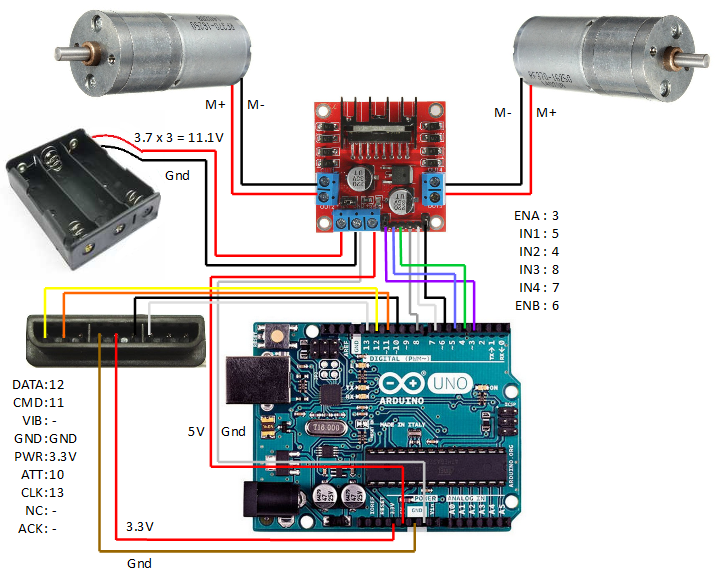

# Arduino Tank Robot with PS2 Controller


A beginner-friendly robotics project featuring a wireless-controlled tank robot using Arduino Uno and PlayStation 2 controller. This responsive robot moves forward, backward, and pivots using analog stick control with deadzone handling for precision movement. Perfect for learning hardware-software integration in robotics!

> Copyright: https://www.instructables.com/Arduino-Robot-With-PS2-Controller-PlayStation-2-Jo/

## Features

- 🎮 **Wireless PS2 Control**: Responsive analog stick control with D-pad fallback
- ⚡ **Dual Power System**: Separate batteries for motors (12V) and control system (9V)
- 🔋 **Safety First**: EVA foam insulation layer prevents short circuits
- 🤖 **Modular Code**: Easy-to-understand motor control functions
- 📶 **Deadzone Handling**: Filter out analog stick noise for precise control
- 🔄 **Auto-Stop**: Halts immediately on controller disconnect

## Hardware Requirements

| Component | Quantity | Notes |
|-----------|----------|-------|
| Arduino Uno | 1 | Rev3 recommended |
| L298N Motor Driver | 1 | H-Bridge module |
| PS2 Controller + Receiver | 1 | Must include wireless receiver |
| Geared DC Motors (6-12V) | 2 | 100-300 RPM recommended |
| Aluminum Tank Chassis | 1 | With tracks and wheels |
| 18650 Batteries | 2 | For motor power |
| 9V Battery | 1 | For Arduino |
| EVA Foam Sheet | 1 | 3mm thickness |

> **Full BOM**: See [bill_of_materials.md](docs/bill_of_materials.md)

## Getting Started

### 1. Hardware Assembly
Follow the step-by-step guide in the [Assembly Instructions](docs/assembly_guide.md)


### 2. Wiring Setup
Connect components as specified in [Pin Mapping](schematics/pin_mapping.md):




### 3. Software Installation

1. Install required library:
   ```bash
   # Using Arduino IDE Library Manager
   Sketch > Include Library > Manage Libraries > Search "PS2X"
   ```
   
2. Upload the main sketch:
   ```arduino
   File > Open > src/tank_robot_ps2.ino
   Sketch > Upload
   ```

3. Verify connection in Serial Monitor (57600 baud):
   ```
   Found Controller, configured successful
   DualShock Controller Found
   ```

## Basic Operation

| Control | Action | PS2 Button |
|---------|--------|------------|
| Forward | Both tracks forward | Left Stick ↑ or D-Pad Up |
| Backward | Both tracks reverse | Left Stick ↓ or D-Pad Down |
| Pivot Left | Right forward, left reverse | Left Stick ← or D-Pad Left |
| Pivot Right | Left forward, right reverse | Left Stick → or D-Pad Right |
| Stop | Release controls | Auto-triggered |

---


---

## Customization Options

### Speed Adjustment
Modify the analog stick sensitivity in code:
```cpp
// src/tank_robot_ps2.ino
const int MAX_SPEED = 200; // Reduce for slower movement (0-255)
```

### Deadzone Tuning
Adjust deadzone threshold for analog sticks:
```cpp
const int DEADZONE = 25; // Increase for looser sticks
```

### Additional Features
1. Enable controller vibration:
   ```cpp
   ps2x.read_gamepad(true, 100); // Enable vibration at 100ms
   ```
   
2. Add LED indicators for direction:
   ```cpp
   // Define LED pins
   #define LED_FRONT 9
   #define LED_REAR 2
   ```

## Troubleshooting

Common issues and solutions:

| Problem | Solution |
|---------|----------|
| Motors vibrate but don't move | Swap IN1/IN2 connections |
| PS2 controller not detected | Verify 3.3V power to receiver |
| Arduino resets during movement | Add capacitor to motor terminals |
| Uneven track movement | Calibrate motor speeds in code |

> **Full troubleshooting guide**: [troubleshooting.md](docs/troubleshooting.md)

## License

Distributed under the MIT License. See [LICENSE](LICENSE) for more information.

## Resources

- [Project Documentation](docs/)
- [PS2X Library Documentation](lib/PS2X_lib/)
- [Instructables Inspiration Project](https://www.instructables.com/Arduino-Robot-With-PS2-Controller-PlayStation-2-Jo/)
