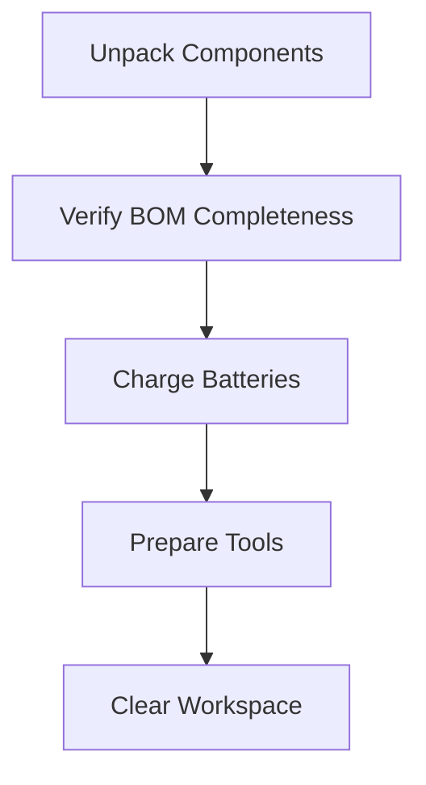
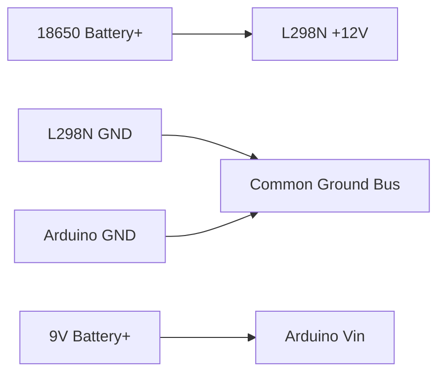

# Arduino Tank Robot - Assembly Guide

## Preparation Stage
**Safety First:**
- Wear safety glasses when cutting aluminum
- Work on anti-static mat (especially when handling Arduino)
- Keep fire extinguisher nearby during power testing

**Pre-Assembly Checklist:**


## Step 1: Chassis Assembly
### Mechanical Components
1. **Base Plate Preparation:**
   - Cut aluminum plate to 15x20cm dimensions
   - File sharp edges smooth
   - Drill 3mm mounting holes for motors and electronics

2. **Motor Installation:**
   ```markdown
   1. Position motors at front corners
   2. Use rubber gaskets between motor and chassis
   3. Secure with M3 bolts and lock washers
   4. Verify shaft alignment with sprockets
   ```
   

3. **Track System Assembly:**
   - Install drive sprockets on motor shafts
   - Mount idler wheels at rear (adjustable tension)
   - Thread rubber tracks with 5-10mm slack

## Step 2: Insulation Layer
**Critical Electrical Isolation:**
```markdown
1. Cut EVA foam to match chassis dimensions
2. Apply double-sided tape to aluminum surface
3. Press foam firmly onto chassis
4. Punch holes through foam for mounting points
5. Verify continuity: 
   - Multimeter should show OL (open) between any component and chassis
```

## Step 3: Electronics Mounting
### Component Layout
| Component | Position | Mounting Method |
|-----------|----------|----------------|
| Arduino Uno | Center | Nylon standoffs |
| L298N Module | Rear | Silicone pads |
| PS2 Receiver | Front | Hot glue |
| Battery Holders | Sides | Velcro strips |

**Installation Sequence:**
1. Mount Arduino with 10mm standoffs
2. Position L298N near motors with thermal pad
3. Secure PS2 receiver at highest point
4. Attach battery holders to sides

## Step 4: Wiring
### Power System Connections


1. **Motor Wiring:**
   - Left Motor → L298N OUT1/OUT2
   - Right Motor → L298N OUT3/OUT4
   - Use heat shrink on all terminals

2. **Control Wiring:**
   ```markdown
   PS2 Receiver to Arduino:
   - CLK → Pin 13
   - CMD → Pin 11
   - ATT → Pin 10
   - DAT → Pin 12
   - VCC → 3.3V
   - GND → GND
   
   L298N to Arduino:
   - ENA → Pin 3
   - IN1 → Pin 4
   - IN2 → Pin 5
   - IN3 → Pin 7
   - IN4 → Pin 8
   - ENB → Pin 6
   ```

### Cable Management
- Bundle wires by system (power/signal)
- Use spiral wrap for motor cables
- Secure with zip ties every 5cm
- Label connections with tape flags

## Step 5: Software Setup
1. **Install Dependencies:**
   ```arduino
   Required Libraries:
   - PS2X_lib (v1.8.0+)
   ```

2. **Upload Sketch:**
   ```markdown
   1. Connect Arduino via USB
   2. Open `src/tank_robot_ps2.ino`
   3. Verify board type: Arduino Uno
   4. Upload code
   ```

## Step 6: Power-On Sequence
**Safety Verification:**
- [ ] No metal-on-metal contact
- [ ] Insulation layer intact
- [ ] All wires secured
- [ ] Tracks move freely

**Startup Procedure:**
1. Connect motor battery first
2. Power Arduino via separate source
3. Press PS button on controller
4. Check serial monitor: `Found Controller`

## Step 7: Calibration
### Motor Direction Test
| Command | Expected Movement | Correction If Wrong |
|---------|-------------------|---------------------|
| Forward | Both tracks forward | Swap IN1/IN2 or IN3/IN4 |
| Left Turn | Right forward, left backward | Reverse motor polarity |
| Right Turn | Left forward, right backward | Swap left/right motor wires |

### Controller Calibration
```markdown
1. Center analog sticks
2. Upload deadzone test sketch:
   void setup() { Serial.begin(57600); }
   void loop() {
     Serial.print("LX: "); Serial.print(ps2x.Analog(PSS_LX));
     Serial.print(" LY: "); Serial.println(ps2x.Analog(PSS_LY));
   }
3. Adjust DEADZONE value until noise stabilizes
```

## Final Verification
**Functional Checklist:**
- [ ] Forward/backward movement
- [ ] Left/right pivoting
- [ ] Stop when releasing controls
- [ ] Auto-stop on controller disconnect
- [ ] No overheating components
- [ ] Minimum 30min runtime

**First Run Protocol:**
1. Test on foam surface
2. Begin at 50% speed
3. Gradually increase to full speed
4. Monitor battery voltage drop

## Maintenance Schedule
| Interval | Task |
|----------|------|
| After 5 runs | Check track tension |
| Monthly | Clean motor brushes |
| Quarterly | Reapply thermal paste on L298N |
| Biannual | Replace EVA insulation |

> **Warning:** Always disconnect power before maintenance!
