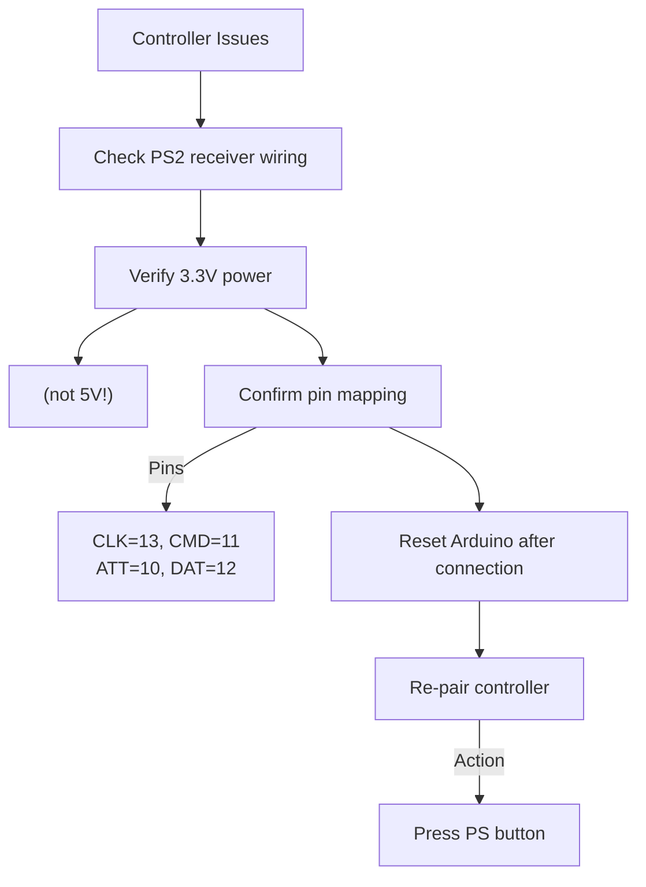

# Common Issues & Solutions

## 🎮 Controller Connection Problems
### Symptoms:
- "No controller found" error
- Intermittent response
- Buttons not registering

### Solutions:



- **Error Code Reference**:
  - `Error 1`: Check wiring continuity (90% loose connections)
  - `Error 2`: Replace controller batteries
  - `Error 3`: Add `ps2x.config_gamepad(13,11,10,12, false, true)` to skip pressure mode

## ⚙️ Motor Issues
### Common Symptoms:
- Motors vibrate but don't rotate
- Only one side works
- Motors run at full speed only

### Quick Fixes:
1. **Motor Test**:
   ```cpp
   // Upload this test sketch:
   void setup() {
     pinMode(4, OUTPUT);  // IN1
     pinMode(5, OUTPUT);  // IN2
     pinMode(3, OUTPUT);  // ENA
   }
   void loop() {
     digitalWrite(4, HIGH);
     digitalWrite(5, LOW);
     analogWrite(3, 150);  // 60% speed
     delay(2000);
     analogWrite(3, 0);    // Stop
     delay(2000);
   }
   ```

2. **Direction Correction**:
   | Wrong Behavior | Fix |
   |----------------|-----|
   | Motor spins backward | Swap IN1 ↔ IN2 connections |
   | Opposite side spins | Swap motor A ↔ motor B wires |
   | Only full speed | Verify PWM pin connections (ENA/ENB) |

## 🔋 Power System Failures
### Symptoms:
- Arduino resets when motors engage
- L298N overheating
- Reduced operation time

### Solutions:
| Issue | Fix | Prevention |
|-------|-----|------------|
| Voltage drop | Add 1000μF capacitor across motor terminals | Use separate batteries for Arduino and motors |
| L298N overheating | Attach heatsink with thermal tape | Keep motor current ≤1.2A per channel |
| Short circuit | Verify EVA insulation under board | Triple-check wire routing before power-on |

## 🤖 Movement Problems
### Tank-Specific Issues:
| Symptom | Solution |
|---------|----------|
| Tracks derail | Tighten idler wheel tension |
| Uneven movement | Align motor mounts parallel |
| Grinding noise | Lubricate sprockets with silicone grease |
| Robot pulls to one side | Calibrate motor speeds in code |

**Speed Calibration**:
```cpp
// In setMotorSpeed() function:
void setMotorSpeed(int left, int right) {
  // Apply calibration factors
  left = left * 0.95;  // Reduce left by 5%
  right = right * 1.0; // Keep right at 100%
  // ... rest of function
}
```

## 💻 Software & Code Issues
### Common Errors:
1. **Motors spin opposite direction**:
   ```cpp
   // In setMotorSpeed():
   // Change left motor logic:
   digitalWrite(IN1, (left > 0) ? HIGH : LOW); // Was LOW:HIGH
   digitalWrite(IN2, (left > 0) ? LOW : HIGH); // Was HIGH:LOW
   ```

2. **Analog controls too sensitive**:
   ```cpp
   // Increase deadzone value:
   const int DEADZONE = 30; // Was 20
   ```

3. **Motors don't stop**:
   ```cpp
   // Add emergency stop condition:
   if(millis() - lastCommand > 1000) stopMotors();
   ```

## 📶 Interference Solutions
### Symptom: Controller disconnects when motors run
- Wrap motors in aluminum foil (grounded)
- Add ferrite beads to motor wires
- Route PS2 cables away from power lines
- Add decoupling capacitor (0.1μF) to Arduino power pins

## 🆘 Emergency Recovery
**When nothing works**:
1. Disconnect all power immediately
2. Remove Arduino from chassis
3. Test basic circuit:
   ```mermaid
   graph LR
       A[9V Arduino] --> B[L298N logic pins]
       C[5V USB] --> D[PS2 receiver]
       E[NO MOTORS] --> F[Verify controller response]
   ```
4. Rebuild incrementally:
   - Add PS2 control
   - Connect one motor
   - Add second motor
   - Install in chassis

## 📊 Debugging Tools
### Serial Monitor Commands:
```cpp
#define DEBUG true  // Uncomment in setup

// Expected output:
[PS2] LY:127 LX:127
[MOTORS] L:0 R:0
[STATUS] No input
```

### Voltage Checklist:
| Point | Min Voltage | Test Method |
|-------|-------------|-------------|
| Motor battery | 7.2V | Multimeter at L298N +12V/GND |
| Arduino Vin | 7V | Multimeter at Vin/GND |
| 5V rail | 4.8-5.2V | Multimeter at 5V/GND |
| 3.3V rail | 3.2-3.4V | Multimeter at 3.3V/GND |

## ❓ Still Stuck?
1. Take high-resolution photos of your wiring
2. Record serial monitor output
3. Open issue on [GitHub repo](https://github.com/yourusername/project-repo)
   - Include Arduino model
   - Controller type (DualShock 2/Other)
   - Battery specifications
