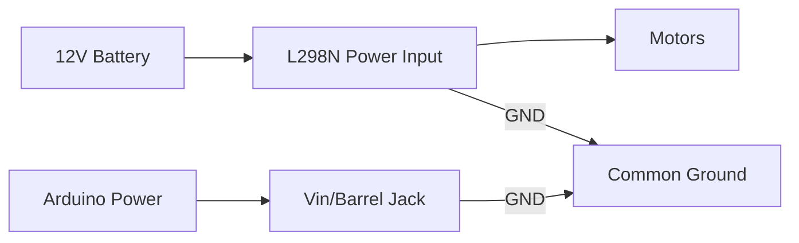

# Arduino Tank Robot - Pin Connections

## Motor Controller (L298N) Connections
| Arduino Pin | L298N Pin | Function              | Wire Color (Suggested) |
|-------------|-----------|-----------------------|------------------------|
| 3 (PWM)     | ENA       | Left Motor Enable    | Yellow                 |
| 4           | IN1       | Left Motor Direction 1 | White                |
| 5           | IN2       | Left Motor Direction 2 | Gray                 |
| 6 (PWM)     | ENB       | Right Motor Enable   | Orange                 |
| 7           | IN3       | Right Motor Direction 1 | Blue                 |
| 8           | IN4       | Right Motor Direction 2 | Green                |

**Power Connections:**
- L298N +12V → Battery+ (7-12V)
- L298N GND → Battery- 
- L298N GND → Arduino GND (common ground)

## PS2 Controller Receiver Connections
| Arduino Pin | PS2 Receiver Pin | Function       | Note                     |
|-------------|------------------|----------------|--------------------------|
| 13          | CLK              | Clock          |                          |
| 11          | CMD              | Command        |                          |
| 10          | ATT              | Attention      |                          |
| 12          | DAT              | Data           |                          |
| 3.3V        | VCC              | Power (3.3V)   | ⚠️ Do not use 5V!       |
| GND         | GND              | Ground         |                          |

## Motor Wiring
| L298N Terminal | Motor Wire | Polarity |
|----------------|------------|----------|
| OUT1           | Left Motor+ |          |
| OUT2           | Left Motor- |          |
| OUT3           | Right Motor+ |         |
| OUT4           | Right Motor- |         |

## Power System

## Critical Notes:
1. **Insulation**: Always maintain EVA foam layer between aluminum chassis and electronics
2. **Power Separation**:
   - Use separate power sources for motors (12V) and Arduino (7-12V)
   - Connect all grounds together
3. **PS2 Voltage**: Receiver requires 3.3V (5V will damage it)
4. **PWM Pins**: Must use PWM-capable pins (3,5,6,9,10,11) for speed control
5. **Cable Management**: 
   - Use zip ties for wire organization
   - Keep motor wires away from signal wires

## Troubleshooting Tips:
- If motors vibrate but don't move: Swap IN1/IN2 or IN3/IN4 connections
- If PS2 not detected: Check 3.3V power and ATT pin connection
- If motors run at full speed only: Verify PWM pin connections (ENA/ENB)
